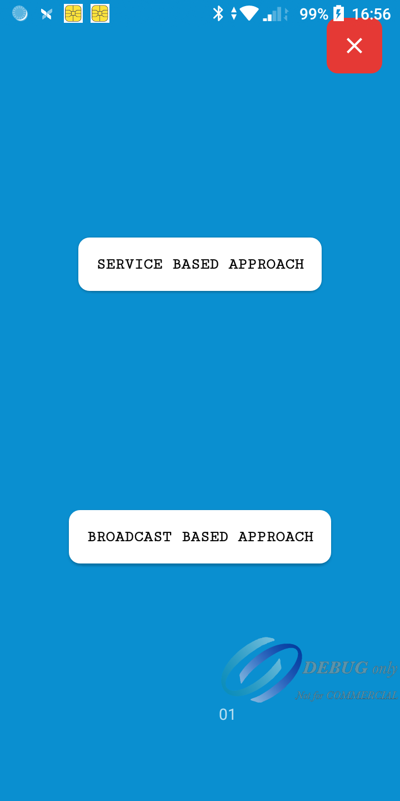

# Payment Loyalty Sample App

## Introduction

The PLM Sample App demonstrates the implementation of triggers to manage loyalty points
for customers based on their payment transactions my mocking the data.

## Table of Contents

- [Features](#features)
- [Installation](#installation)
- [Triggers](#triggers)
- [How To Send Trigger](#howToSendTrigger)
- [Notes](#notes)

## Features

- Demonstrate usage triggers using the broadcast intents
- Demonstrate usage triggers using the service
#### Sample Video (https://github.com/koti-pl/PLSample/blob/master/docs/sample_flow.mp4)
[](https://github.com/koti-pl/PLSample/blob/master/docs/sample_flow.mp4 "Watch")

## Installation
Clone the repository:
```shell 
git clone https://github.com/koti-pl/PLSample.git
```

## Triggers

1. **Post Amount(T1):** This trigger is activated after the user enters the payment amount. It
   serves as
   a signal for the Payment Loyalty Manager (PLM) to commence searching for applicable rewards based
   on the merchant's configurations. By sending this trigger, the system initiates the reward
   identification process, ensuring that users are offered relevant benefits corresponding to their
   transaction amount and the merchant's loyalty program.

2. **Post Card(T2):** Upon successful authentication of the user's card, this trigger is need to
   send to the
   payment loyalty app. It prompts the app to query its available rewards associated with the
   specific card. This ensures that users are promptly notified of any potential rewards or benefits
   they can avail themselves of with their authenticated card, enhancing the overall user experience
   and Motivating card usage.

3. **Post Transaction(T3):** Following the completion of a transaction, this trigger need to send.
   Its
   purpose is to facilitate various post-transaction activities within the Payment Loyalty
   ecosystem.
   Specifically, it enables the payment loyalty app to mark the status of any associated coupons or
   rewards, ensuring accurate tracking and management of redeemed offers. Additionally, it allows
   for the seamless capture of transaction details, minimizing the risk of discrepancies or issues
   related to redeemed transactions. By leveraging this trigger, the system ensures a smooth and
   reliable post-transaction process, enhancing user satisfaction and operational efficiency.

## How To Send Trigger

We can send Triggers by using
1. [Broadcast intents](https://developer.android.com/develop/background-work/background-tasks/broadcasts)
2. [Service and Messenger](https://developer.android.com/develop/background-work/services/bound-services)

### [Broadcast intents](https://developer.android.com/develop/background-work/background-tasks/broadcasts) : Use the following code snippets to send T1,T2 and T3 triggers by using broadcast intents

#### Post Amount Trigger(T1)
```kotlin
/**
 * Posts the entered amount information to the Payment Loyalty Module (PLM) app if installed on the device.
 *
 * @param amount The amount entered by the user.
 * @return Boolean indicating whether the entered amount information was successfully posted to the PLM app.
 */
fun Context.sendPostAmountEntered(
    amount: String
): Boolean {
    // Check if the PLM app is installed on the device
    return if (isPLMInstalled(packageManager)) {
        // Create an intent to trigger the PLM app with the entered amount details
        val intent = Intent(PLIntentsFilters.TRIGGER_ACTION).apply {
            putExtra(PLIntentParamKey.AMOUNT, amount)
            putExtra(PLIntentParamKey.LAUNCH_FROM, PLIntentTrigger.POST_AMOUNT_ENTRY)
            addFlags(Intent.FLAG_INCLUDE_STOPPED_PACKAGES) // Ensure the intent is delivered to the PLM app
        }

        // Send a broadcast to the PLM app with the entered amount details
        sendBroadcast(intent)

        // Return true indicating successful posting of entered amount information
        true
    } else {
        // Continue with the payment if the PLM app is not installed
        false
    }
}
```
#### Post Card Present Trigger(T2)
```kotlin
/**
 * Posts information about a card presentation event to the Payment Loyalty Module (PLM) app if installed on the device.
 *
 * @param cardToken The token representing the user's card information.
 * @param cardType The type of the (ex: visa)
 * @param amount The amount associated with the card presentation event.
 * @return Boolean indicating whether the card presentation event was successfully posted to the PLM app.
 */
fun Context.sendPostCardPresent(
    cardToken: String,
    cardType: String? = null,
    amount: String
): Boolean {
    // Check if the PLM app is installed on the device
    return if (isPLMInstalled(packageManager)) {
        // Create an intent to trigger the PLM app with card presentation details
        val intent = Intent(PLIntentsFilters.TRIGGER_ACTION).apply {
            putExtra(PLIntentParamKey.CARD_TOKEN, cardToken)
            putExtra(V2Trigger.Params.CARD_TYPE, cardType)
            putExtra(PLIntentParamKey.AMOUNT, amount)
            putExtra(PLIntentParamKey.LAUNCH_FROM, PLIntentTrigger.POST_CARD_PRESENTED)
            addFlags(Intent.FLAG_INCLUDE_STOPPED_PACKAGES)
        }

        // Send a broadcast to the PLM app with the card presentation details
        sendBroadcast(intent)

        // Return true indicating successful card presentation posting
        true
    } else {
        // Return false if the PLM app is not installed
        false
    }
}
```
#### Post Transaction Trigger(T3)
```kotlin
/**
 * Posts a transaction to the Payment Loyalty Module (PLM) app if installed on the device.
 *
 * @param cardToken The token representing the user's card information.
 * @param cardType The type of the (ex: visa)
 * @param amount The amount associated with the transaction.
 * @param transactionId The current transaction id.
 * @param transactionStatus The current transaction status. If transaction is success then it is true otherwise false
 * @return Boolean indicating whether the transaction was successfully posted to the PLM app.
 */
fun Context.sendPostTransaction(
    cardToken: String,
    cardType: String? = null,
    amount: String,
    transactionId: String? = null,
    transactionStatus: Boolean
): Boolean {
    return if (isPLMInstalled(packageManager)) {
        val intent = Intent(PLIntentsFilters.TRIGGER_ACTION).apply {
            putExtra(PLIntentParamKey.CARD_TOKEN, cardToken)
            putExtra(V2Trigger.Params.CARD_TYPE, cardType)
            putExtra(PLIntentParamKey.AMOUNT, amount)
            putExtra(PLIntentParamKey.LAUNCH_FROM, PLIntentTrigger.POST_TRANSACTION)
            putExtra(V2Trigger.Params.TRANSACTION_STATUS, transactionStatus)
            putExtra(V2Trigger.Params.TRANSACTION_ID, transactionId)
            addFlags(Intent.FLAG_INCLUDE_STOPPED_PACKAGES)
        }
        sendBroadcast(intent)
        true
    } else { //If plm app not installed
        false
    }
}
```

#### Register Broadcast to receive the intents from Payment loyalty application with and unregister on destroy / detaching the view
```kotlin
  //Register receiver on start of the view 
override fun onStart() {
    super.onStart()
    registerReceiver()
}

// Register the confirmation action receiver
private fun registerReceiver() {
    val intentFilter = IntentFilter()
    intentFilter.addAction("com.payment.confirm")
    registerReceiver(statusBroadcastReceiver, intentFilter)
}


private val statusBroadcastReceiver = object : BroadcastReceiver() {
    override fun onReceive(context: Context, intent: Intent) {
        handleTriggerResponse(intent)
    }
}

//Handle the response from payment loyalty
private fun handleTriggerResponse(intent: Intent) {
    when (intent.getIntExtra(PLIntentParamKey.STATUS, PLStatus.NO_ACTION_NEEDED)) {
        PLStatus.REWARD -> {
            //If we receive the any discount need to append and continue to payment
            val discountAmount = (intent.getStringExtra(PLIntentParamKey.DISCOUNT) ?: "0").trim()
            adjustTheAmount(discountAmount)
        }

        PLStatus.OPEN_APP -> {
            amount?.let {
                openPLMApp(
                    launcher = activityResultLauncher,
                    amount = it,
                    cardToken = cardToken,
                    launchFrom = activeTrigger
                )
            }
        }

        else -> {
            //continue to payment
        }
    }
}

//Unregister Receiver
override fun onDestroy() {
    super.onDestroy()
    unregisterReceiver(statusBroadcastReceiver)
}
```

### [Service and Messenger](https://developer.android.com/develop/background-work/services/bound-services) : Use the following code snippets to send T1,T2 and T3 triggers by using service and messenger

Due to various limitations with broadcasts starting from Android 8, we have introduced a new
communication channel using services for more effective app-to-app communication.

Start the service before initiating any transaction. It is not necessary to start the service with
every transaction if it is already running and the service connection is available. However, to send
and receive triggers to PLM, it is mandatory to have an active connection to the service.

#### Start service

##### Begin with by adding the trigger permissions into project manifest 

```xml
<uses-permission android:name="co.paymentLoyalty.permission.TRIGGER" />
```

```kotlin
private var serverMessenger: Messenger? = null
private val serviceConnection = object : ServiceConnection {
    override fun onServiceConnected(name: ComponentName?, service: IBinder?) {
        Log.i(TAG, "Service : onServiceConnected")
        serverMessenger = Messenger(service)
        handleVisibility()
        updateTriggerResponse(
            PLTriggerResponse(
                status = PLStatus.RECEIVED_TRIGGER,
                discount = null,
                message = "Server Connected"
            )
        )
    }

    override fun onServiceDisconnected(name: ComponentName?) {
        Log.i(TAG, "Service : onServiceDisconnected")
        serverMessenger = null
        handleVisibility()
    }
}

private fun startService() {
   if (isPLMInstalled(packageManager)) {
      val intent = Intent(PLIntentsFilters.TRIGGER_ACTION)
      intent.setPackage(PLIntentsFilters.APP_ID)
      intent.addCategory(PLIntentsFilters.TRIGGER_INTENT_CATEGORY)
      bindService(intent, serviceConnection, Context.BIND_AUTO_CREATE)
   } else {
      showError("PLM Not available")
   }
}
```
#### Stop service
```kotlin
 private fun stopService() {
    serverMessenger?.let {
        unbindService(serviceConnection)
        serverMessenger = null
        handleVisibility()
    } ?: run {
        showError("PLM Not running!")
    }
}
```

#### Create Handler to receive the data from the PLM
```kotlin
 inner class IncomingHandler(looper: Looper) : Handler(looper) {
    override fun handleMessage(msg: Message) {
        val serverResponse = msg.data.getPostAmountEntryResponse()
        Log.d("Trigger Received", "response: $serverResponse")
        when (msg.what) {
            PLStatus.RECEIVED_TRIGGER -> {
                //When we receive the status as RECEIVED_TRIGGER it means payment loyalty app received your request
            }

            PLStatus.OPEN_APP -> {
                updateTriggerResponse(serverResponse)
                amount?.let {
                    openPLMApp(
                        launcher = activityResultLauncher,
                        amount = it,
                        cardToken = cardToken,
                        launchFrom = activeTrigger
                    )
                }
            }

            PLStatus.REWARD -> {
                //If there is any reward you can adjust the amount and continue payment
                processTheReward(serverResponse)
            }

            PLStatus.FAIL -> {
                //When we receive the status as FAIL, Means there is no reward or some unexpected error happened, So you can continue with payment
                //Continue with payment
            }

            else -> super.handleMessage(msg)
        }
    }
}
```

Refer to [BroadcastBasedIntegrationActivity](https://github.com/koti-pl/PLSample/blob/feature/update_readme/app/src/main/java/co/pl/plsample/BroadcastBasedIntegrationActivity.kt) for more implementation details

#### To send and triggers need to create a object of PLV2Triggers. [PLV2Triggers](https://github.com/koti-pl/PLSample/blob/feature/update_readme/app/src/main/java/co/pl/plsample/plSDK/PLV2Triggers.kt) has all required trigger implementation. Simply copy to you project source and create object as shown

```kotlin
val triggers: (serverMessenger: Messenger, incomeMessenger: Messenger) -> PLV2Triggers =
    { serverMessenger, incomeMessenger ->
        PLV2Triggers(serverMessenger, incomeMessenger)
    }
```

#### Post Amount Trigger(T1)
```kotlin
override fun postAmountEntered(amount: String) {
    if (amount.isNotEmpty()) {
        serverMessenger?.let {
            triggers(it, incomeMessenger).sendPostAmount(amount)
            activeTrigger = PLIntentTrigger.POST_AMOUNT_ENTRY
        } ?: run {
            showError(ERROR_SERVICE_NOT_AVAILABLE)
        }
    } else {
        showError("Enter valid amount to continue!")
    }
}
```

#### Post Card Present Trigger(T2)
```kotlin
 override fun postCardPresented(amount: String, cardToken: String, cardType: String?) {
    if (amount.isNotEmpty() && cardToken.isNotEmpty()) {
        serverMessenger?.let {
            triggers(it, incomeMessenger).sendPostCard(amount, cardToken, cardType ?: "")
            activeTrigger = PLIntentTrigger.POST_CARD_PRESENTED
        } ?: run {
            showError(ERROR_SERVICE_NOT_AVAILABLE)
        }
    } else {
        showError("Provide valid amount and cardToken to continue!")
    }
}
```

#### Post Transaction Trigger(T3)
```kotlin
 override fun postTransaction(
    amount: String,
    cardToken: String,
    cardType: String?,
    transactionId: String?,
    transactionStatus: Boolean
) {
    if (amount.isNotEmpty() && cardToken.isNotEmpty()) {
        serverMessenger?.let {
            triggers(it, incomeMessenger).sendPostTransaction(
                amount,
                cardToken,
                cardType,
                transactionId,
                transactionStatus
            )
            activeTrigger = PLIntentTrigger.POST_TRANSACTION
        } ?: run {
            showError(ERROR_SERVICE_NOT_AVAILABLE)
        }
    } else {
        showError("Invalid data to process the trigger")
    }
}
```
### How to launch the PLM
When the payment app receives the trigger status as [6] then launch the activity using the following code. You will receive the result as 'OK' if there is any reward available.

##### Launching PLM
```kotlin
/** activity launcher*/
    var activityResultLauncher =
        registerForActivityResult(ActivityResultContracts.StartActivityForResult()) { result ->
            if (result.resultCode == Activity.RESULT_OK) {
                result.data?.let {
                    val status = it.getIntExtra(PLIntentParamKey.STATUS, 0)
                    if (status == PLStatus.REWARD) {
                        val discountAmount = (it.getStringExtra(PLIntentParamKey.DISCOUNT)?: "0").trim()
                        adjustTheAmount(discountAmount)
                    } else {
                        Log.e(TAG, "continue payment==>")
                        // Process with actual amount (no reward)
                        // You might want to include your actual amount processing logic here
                    }

                } ?: run {
                    Log.e(TAG, "continue payment==>")
                    // Process with actual amount (no reward)
                    // You might want to include your actual amount processing logic here
                }

            } else {
                // handle error state
            }
        }

/**
 * Opens the Payment Loyalty Module (PLM) app with specified parameters.
 *
 * @param launcher The activity result launcher for handling the result of the PLM app launch.
 * @param amount The amount associated with the transaction.
 * @param cardToken The token representing the user's card information.
 * @param launchFrom A string indicating the context or origin of the app launch.
 * @return Boolean indicating whether the PLM app launch is successful or not.
 */
fun openPLMApp(
   launcher: ActivityResultLauncher<Intent>,
   amount: String,
   cardToken: String,
   launchFrom: String
): Boolean {
   try {
      val intent = Intent(PLIntentsFilters.OPEN_PLM_ACTION).apply {
         flags = Intent.FLAG_INCLUDE_STOPPED_PACKAGES
         putExtra(PLIntentParamKey.AMOUNT, amount)
         putExtra(PLIntentParamKey.CARD_TOKEN, cardToken)
         putExtra(PLIntentParamKey.LAUNCH_FROM, launchFrom)
      }
      launcher.launch(intent)
      return true
   } catch (e: Exception) {
      e.printStackTrace()
   }
   return false
}

```

Refer to [ServiceBasedIntegrationActivity](https://github.com/koti-pl/PLSample/blob/feature/update_readme/app/src/main/java/co/pl/plsample/ServiceBasedIntegrationActivity.kt)

### See [plSDK](https://github.com/koti-pl/PLSample/tree/feature/update_readme/app/src/main/java/co/pl/plsample/plSDK) package for more implementation details about triggers

## notes
1. The CardToken must not be an actual card number. It should instead be a unique and repeatable identifier assigned to each card to identify and access specific card or user-related loyalty points.
2. On the Post Card trigger (T2), if PLM returns any discounts, the Payment app should request card authentication again with the adjusted amount. However, there's no need to resend the post card trigger (T2) during the second card authentication. Instead, we always anticipate the post-transaction trigger (T3) following the post card trigger (T2).    
3. Ensure that there is always one active campaign synced on the terminal to run any loyalty program. If there are no active campaigns, PLM will be in an inactive state with no campaign running.  
4. To start using triggers, Make sure you have added the permission <uses-permission android:name="co.paymentLoyalty.permission.TRIGGER" />  
5. Make sure the service connection is established before sending any triggers with service based approach.
